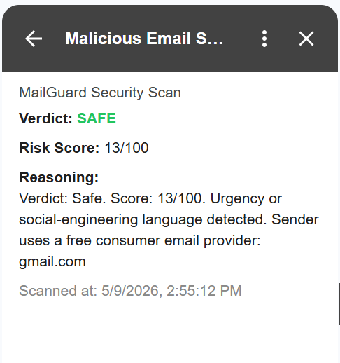
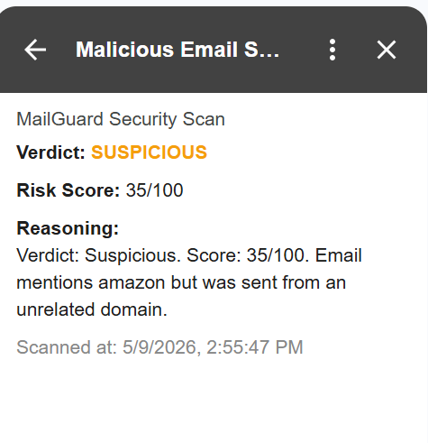
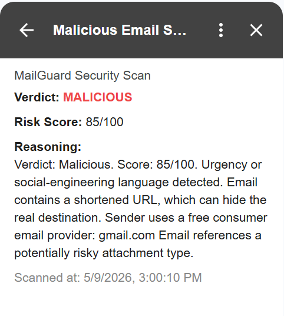

# MailGuard – Gmail Malicious Email Scanner

MailGuard is a Gmail Add-on that analyzes opened emails and detects suspicious or potentially malicious indicators using a rule-based security scoring engine.

The system integrates directly into Gmail and provides:

* A security verdict (`SAFE`, `SUSPICIOUS`, `MALICIOUS`)
* A numerical risk score
* Human-readable reasoning explaining why the email was flagged

The project combines:

* Gmail Add-ons (Google Apps Script)
* FastAPI backend
* Rule-based phishing detection heuristics
* Real-time Gmail integration

---

# Features

## Gmail Integration

* Runs directly inside Gmail as an Add-on
* Analyzes the currently opened email
* Displays results in a Gmail side panel

## Security Analysis Engine

The backend evaluates multiple phishing and malicious-email indicators, including:

* Urgency / social-engineering language
* Credential request detection
* URL shorteners
* Bare IP links
* Suspicious TLDs
* Free email providers
* Lookalike / typosquatted domains
* Brand impersonation
* Risky attachment references
* Spam-style formatting

## Explainable Detection

Instead of returning a black-box result, MailGuard explains:

* Why the email received its score
* Which suspicious behaviors were detected

---

# Demo Screenshots

## 🟢 Safe Email

Low-risk email with minimal suspicious indicators.



---

## 🟠 Suspicious Email

Email containing possible impersonation or suspicious content.



---

## 🔴 Malicious Email

High-risk phishing-style email containing multiple malicious indicators.



---

# Project Structure

```text
MailGuard/
│
├── main.py            # FastAPI backend API
├── models.py          # Pydantic request/response schemas
├── scoring.py         # Security scoring engine and phishing heuristics
│
├── Code.gs            # Gmail Add-on frontend logic
├── appsscript.json    # Gmail Add-on manifest and permissions
│
├── README.md
└── screen/
    ├── safe.png
    ├── suspicious.png
    └── malicious.png
```

---

# Backend Architecture

## main.py

Defines the FastAPI application and exposes:

* `/analyze` endpoint for email analysis
* `/health` endpoint for health checks

## models.py

Defines all structured request and response models using Pydantic.

## scoring.py

Contains the phishing detection engine and scoring logic.

The engine evaluates multiple security signals and calculates:

* Risk score
* Verdict
* Human-readable explanation

---

# Gmail Add-on Flow

```text
Gmail Email
     ↓
Google Apps Script Add-on
     ↓
FastAPI Backend (/analyze)
     ↓
Security Scoring Engine
     ↓
Verdict + Score + Reasoning
     ↓
Displayed inside Gmail
```

---

# Technologies Used

## Backend

* Python
* FastAPI
* Pydantic
* Uvicorn

## Frontend / Integration

* Google Apps Script
* Gmail Add-ons API

## Development Tools

* ngrok
* Git
* GitHub

---

# Verdict Levels

| Score Range | Verdict    |
| ----------- | ---------- |
| 0 – 25      | SAFE       |
| 26 – 60     | SUSPICIOUS |
| 61 – 100    | MALICIOUS  |

---

# Example Malicious Indicators

Examples of signals that increase the score:

* “URGENT – Verify your password immediately”
* Suspicious shortened links (`bit.ly`)
* Fake PayPal / Amazon impersonation
* Risky attachment references (`invoice.zip`, `update.exe`)
* Typosquatted domains (`paypa1.com`)

---

# Running the Backend Locally

## 1. Create virtual environment

```bash
python -m venv venv
```

## 2. Activate virtual environment

### Windows

```bash
venv\Scripts\activate
```

## 3. Install dependencies

```bash
pip install fastapi uvicorn pydantic
```

## 4. Run FastAPI server

```bash
uvicorn main:app --reload
```

---

# Running ngrok

Expose the local backend publicly:

```bash
ngrok http 8000
```

Use the generated ngrok URL inside:

```javascript
const BACKEND_URL = "https://YOUR-NGROK-URL/analyze";
```

---

# Future Improvements

Potential future enhancements:

* SPF / DKIM / DMARC validation
* Real attachment scanning
* Domain reputation APIs
* Machine learning classification
* Persistent database
* Threat intelligence integration
* Cloud deployment (Google Cloud Run / AWS)
